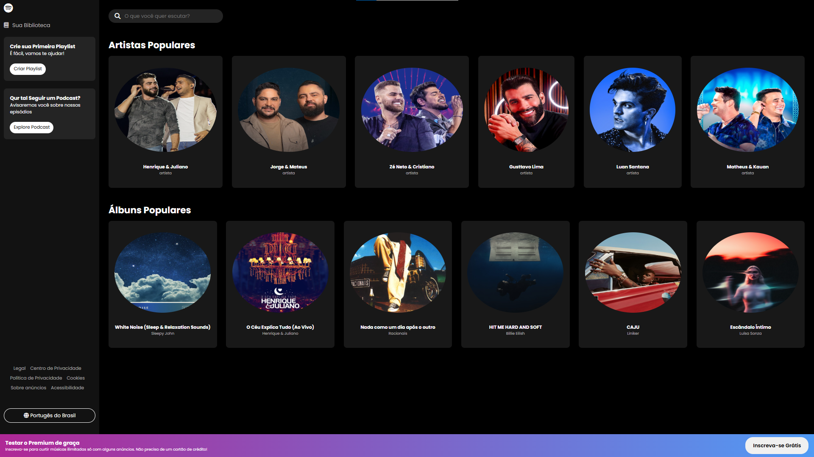

## Página do Spotify 

Neste projeto recriei a página do Spotify, analisei como era o aplicativo e pratiquei. Montei a página inicial, onde mostra artistas, álbuns, criar playlist, podcast, idioma, barra de pesquisa e um botão para obter o premium bem prático.
Esse projeto é um clone da página inicial do Spotify feito com HTML, CSS e JavaScript.

## Tecnologias utilizadas

 
  
  
  

## Como eu fiz

Primeiramente utilizei o HTML para criar o site, os botões e organizar tudo, dps fui pra o CSS e para o JavaScript, enquanto criava algo no JavaScript, eu estilizava ele no CSS.
No JavaScript comecei a usar as variáveis para adicionar as fotos e informações de cada artista e álbum na página.

##  Visão Geral

O projeto replica a interface principal da plataforma Spotify Web, incluindo:

- Layout responsivo
- Menu lateral de navegação
- Seções de playlists e álbuns
- Estilização visual do Spotify

## Captura de Tela

## Contato

Feito por Arthur Lima

